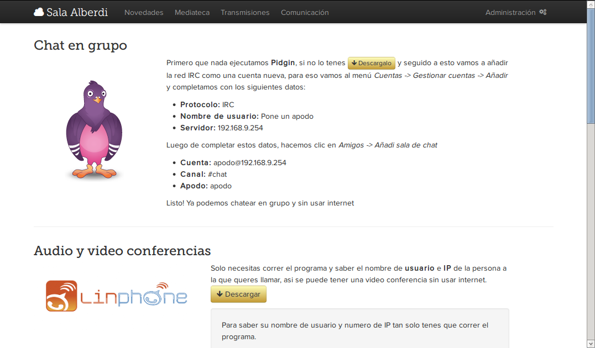

#Nodo de Guerrilla

Configuración de [OpenWRT](http://openwrt.org/) para compartir internet y tener servicios de intranet

- Es un nodo pensado para compartir internet (con un solo dispositivo)
 - Almacenar, cachear, lo posible para acelerar internet [polipo](http://www.pps.univ-paris-diderot.fr/~jch/software/polipo/) y [ziproxy](http://ziproxy.sourceforge.net/)
- Transmitir vídeo localmente [icecast](http://icecast.org/)
- Compartir archivos por la red interna [samba](https://www.samba.org/) 
- Si se le enchufa una [webcam al router](http://h-wrt.com/en/doc/webcam) transmitir vídeo, ver [Edison Carter](https://github.com/b4zz4/ManifestanteXXI#edison-carter)

  

- Hablar por SIP telefónia [linphone](http://linphone.org/)
- Chatear por IRC [ngirc](http://ngircd.barton.de/) y [pidgin](http://pidgin.im/)

---

#Primera experiencia

Texto basado en la [experiencia en la Sala Alberdi](http://www.bibliobarracas.com.ar/?s=comando+richard+stallman) a tenido varios éxitos y fracasos.

##Situación

Es una acampe en una plaza seca y la toma de una sala de teatro en el 6to piso del _Centro Cultural San Martín_.

El problema que se plantea es tener una conexión a internet e intranet para la comunicación interna del grupo y sobre todo comunicación con la gente encerrada en el 6to piso.

<pre>
✔ esta andando
</pre>

##Solución

Para resolver el problema que se plantea conectar un router por **wireless** usando redes disponibles, hay varias de ellas de abiertas y **WEP** (y se conoce la clave de muchas de ellas).
Luego de conectar a internet se necesita algo que transmita la información a las maquinas conectadas por aire, para eso se usa un router que pueda ser puesto en modo AP (punto de acceso) y cliente.
Dada la configuración del router este se conecta solo a internet, a la red con mayor señal y disponibilidad de internet.
Portal cautivo para los vecinos y personas que se conectan por primera vez a la red, informando como usar la red, y sus características. Esto da la posibilidad de un encuentro con los vecinos de un modo diferente, tener un lugar donde informar sobre los sucesos, y explicar las características de la condición de la red. (no aplicado todavía)

### Conectividad

- Conectador a redes abiertas por señal ✔
 - se conecte a los routers de una lista (wep o wap) ✔
 - rompa redes en su tiempo libre
- Transmisor a internet suficiente
 - enviar track de sonidos uno tras otro
 - enviar fotos en secuencia ✔

### Servicios

- Transmisor con AP ✔  y/o Portal cautivo (solo para clientes)
- Clon de un wifi (solo a redes abiertas)

## Piezas

- polipo + tinyproxy + ziproxy
- portal cautivo = dnsmasq + uhttpd ✔ + polipo (?), muy simple `echo "address=/#/gaspacho.local" >> /etc/dnsmasq.conf`
 - nocatsplash parece mejor que dnsmasq
- armador de temas en bootstrap ✔ + contenido adhoc 
- transmisor = mjpeg ✔ + sox
- rompedor de claves = script con aircrack
- imitador de wifi = algo que lea MAC, frecuencia, SSID y los ponga en el router.
- chat con mosquitto
- lvpn

### Mecánica

<pre>
	Lista de redes (en listada por potencia)
		|
	¿alguna conocida?
	        | \ SI: me conecto
	     NO |
	hay redes abiertas
		\ SI: me conecto
</pre>	

**paralelamente:** busco redes wps, wep y wap en listadas por potencia y [trato de romperlas](quehaceres/wepcrack.sh).

---

###Problemas cotidianos

####Se desconecta el equipo

La mayoría de los equipos electrónicos si se desconectan no ocurre casi nada, en el caso del router deja sin disponibilidad de red a los usuarios, tarda mucho en volver a iniciar cuando se lo reconecta, genera la falsa impresión de que no anda y puede romperse.
Muchas veces, demasiadas, las cosas no están donde las dejamos o se las desconectan, o cambian de posición y/o forma.

- Por falta de atención
- Por malas costumbres
- No les parece que la red sea importante, igual hay redes a las cuales conectarse.

#####Solución

- Paciencia
- Pegarlas, atarlas, encintarlas
- Hace un toma corrientes dedicado para la red, encintarlo (con cinta aisladora) y hacer notas de que eso no hay que tocarlo.
- Baterías con un cargador (no aplicada todavía)

####Red interna

La mayoría de la gente no entiende el conecto de red interna

#####Solución

Ejemplificar con servicios simple y efectivos: Paginas de descargas, [IRC](http://www.pidgin.im/), [Linphone](http://www.linphone.com/), portal cautivo (no aplicado todavía)

####Sobrecarga de la red

La red en su mayoría se usa para usos triviales:  Búsquedas, Redes sociales, subir fotos, mandar mails sociales, etc.

#####Solución

- Cache: acelera mucho la red
- Reemplazar paginas por versiones para celulares (no aplicada todavía)

####¿Tenes internet?

El pedido constante de internet o una computadora para hacer algo.

#####Solución

- Decir a cada rato: "No tengo internet"
- Poner maquinas para este fin (no aplicada todavía)

###Información

Como difundir y manejar le red. Manejar bien la información, hacer la red internet y la conexión a internet antes que nada.

- No darle las claves de las redes a todo el mundo
- Tener carteles para informa de como conectar a la red
- Tener carteles de no desconectar
- Tenes maquinas para el uso general, y otras para el uso especifico
- Tener un área técnica y otra para usuarios

###Quehaceres

- Instalador
- Portal cautivo
- IRC web con cgi
- Upload con cgi
- VPN y Librevpn
- Editor simple para el portal cautivo (posiblemente http://freifunk.net/)
- Explicar como montar todo en una ISO
- Lista de claves web editables
- Conexión a wifi usando comandos de uci

##Vease

- [OpenWRT](http://openwrt.org/)
- [Polipo con cache y filtro](http://repo.hackcoop.com.ar/polipo-config.git/)
- [Repo de hacklab](http://git.hackcoop.com.ar/)
